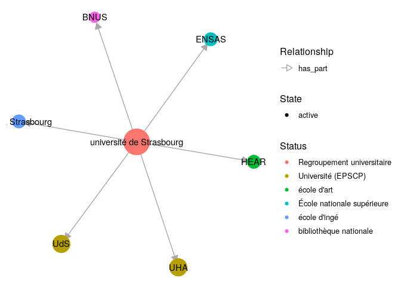
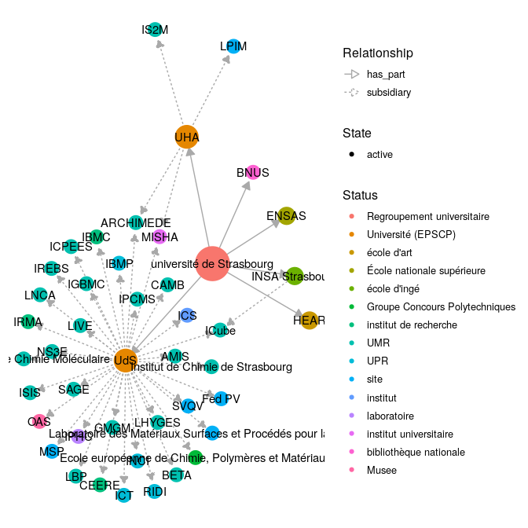

<!-- README.md is generated from README.Rmd. Please edit that file -->

# WikidataESR

<!-- badges: start -->

<!-- badges: end -->

**WikidataESR** est une librairie R s’appuyant sur
[**wikidataR**](https://github.com/Ironholds/WikidataR) pour récupérer
les données de l’ESR dans [Wikidata](https://www.wikidata.org) et
produire des graphiques.

## Installation

**WikidataESR** peut s’installer directement depuis GitHub avec
[**devtools**](https://github.com/r-lib/devtools) :

``` r
# install.packages("devtools")
remotes::install_github("nfrerebeau/DataESR")
```

## Usage

``` r
# Load package
library(WikidataESR)
```

### Récupérer les données

Pour récupérer les données, vous devez disposer d’un identifiant
wikidata racine, et savoir quelles
[propriétés](https://github.com/juliengossa/DataESR/tree/master/etablissements.esr#liste-proprietes)
vous souhaitez explorer.

L’exploration se fait avec la fonction `wdesr_get_graph`.

Par exemple, il est possible d’explorer les établissements du Site
Alsace :

  - L’*identifiant wikidata* est
    [Q61716176](https://www.wikidata.org/wiki/Q61716176) ;
  - Les *propriétés* sont `subsidiary` (“composante”) et `has_part`
    (“associé”) ;
  - Il est possible de fixer une *profondeur* pour
l’exploration.

<!-- end list -->

``` r
alsace <- wdesr_get_graph("Q61716176", property = c("subsidiary", "has_part"), 
                          depth = 1)
```

Pour faciliter les contributions, la fonction déclenche des warning pour
chaque problème potentiel lié aux données saisie dans wikidata.

Elle retourne un objet contenant vertices et edges, qui représentent les
établissements et leurs
relations.

| id        | label                                                   | alias                    | status                     | level |
| :-------- | :------------------------------------------------------ | :----------------------- | :------------------------- | ----: |
| Q157575   | université de Strasbourg                                | UdS                      | Université (EPSCP)         |     3 |
| Q21041502 | Haute école des arts du Rhin                            | HEAR                     | école d’art                |     4 |
| Q280183   | université de Haute-Alsace                              | UHA                      | Université (EPSCP)         |     3 |
| Q3578190  | École nationale supérieure d’architecture de Strasbourg | ENSAS                    | École nationale supérieure |     4 |
| Q521036   | Institut national des sciences appliquées de Strasbourg | INSA Strasbourg          | école d’ingé               |     4 |
| Q61716176 | université de Strasbourg                                | université de Strasbourg | Regroupement universitaire |     2 |
| Q630461   | bibliothèque nationale et universitaire de Strasbourg   | BNUS                     | bibliothèque nationale     |     5 |

| from      | to        | type      | date | depth |
| :-------- | :-------- | :-------- | :--- | ----: |
| Q61716176 | Q280183   | has\_part | NA   |     1 |
| Q61716176 | Q157575   | has\_part | NA   |     1 |
| Q61716176 | Q521036   | has\_part | NA   |     1 |
| Q61716176 | Q630461   | has\_part | NA   |     1 |
| Q61716176 | Q3578190  | has\_part | NA   |     1 |
| Q61716176 | Q21041502 | has\_part | NA   |     1 |

### Tracer des représentations

Il est possible de tracer directement le graphe retourné par
`wdesr_get_graph` :

``` r
plot(alsace)
```

<!-- -->

### Plus de profondeur

Il est souvent utile d’aller plus en profondeur pour explorer plus de
relations. Cela se fait en modifiant l’argument `depth`
:

``` r
alsace <- wdesr_get_graph("Q61716176", c("subsidiary", "has_part"), depth = 2)
plot(alsace)
```

<!-- -->

### Gestion du cache

Afin de ne pas avoir à retélécharger systématiquement les données,
`wikidataESR` utilise un cache local. Il est possible de sauvegarder ce
cache pour une utilisation future avec `wdesr_save_cache()`.

Il suffira ensuite de recharger le cache à la prochaine session pour ne
pas retélécharger les données avec `wdesr_load_cache()`. Attention : en
cas de modification des données sur wikidata, les données du cache local
peuvent être périmées.

Il est enfin possible d’accéder directement au cache avec
`wdesr_get_cache()`.
